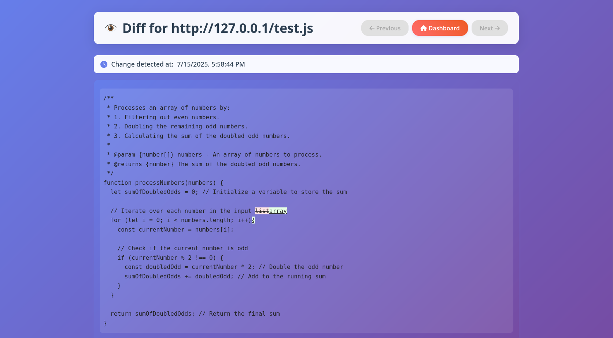
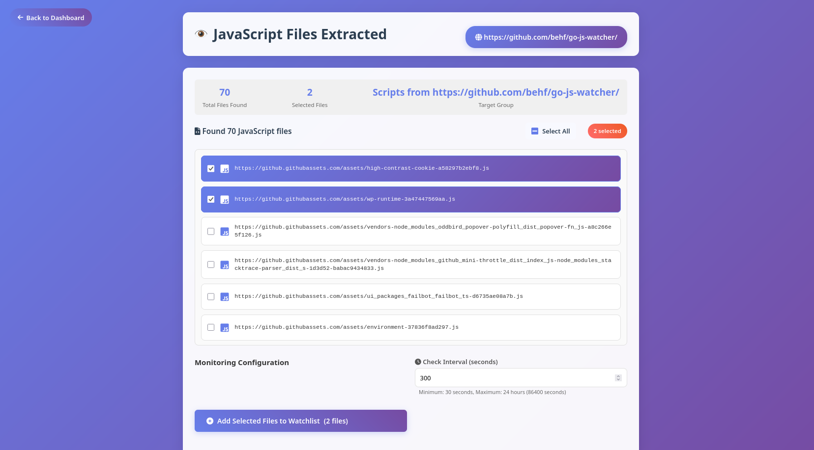

# Go JS Watcher

Go JS Watcher is a powerful and lightweight tool designed to monitor JavaScript endpoints (or any web page) for changes in their content. When a change is detected, it calculates a character-level diff and can send notifications to Telegram. It also provides a web-based dashboard to manage watched URLs and view historical changes.

This tool is built with Go, leveraging its efficient concurrency features for background checking, eliminating the need for complex external task queues.

## Screenshots




## Features

*   **URL Monitoring:** Watch any public URL for content changes.
*   **Configurable Intervals:** Set how frequently each URL is checked.
*   **Automatic Extraction:** Extract javascript files from a page using third party tools.
*   **Character-Level Diffing:** Precise highlighting of added and removed characters/words.
*   **Change History:** View a list of all detected changes for each URL.
*   **"Read" / "Unread" Status:** Easily differentiate between changes you've reviewed and new ones.
*   **Previous/Next Diff Navigation:** Seamlessly browse through a URL's change history.
*   **Disable/Enable URLs:** Temporarily pause monitoring for specific URLs without removing them.
*   **Edit URLs:** Modify a URL's address or check interval after it's been added.
*   **Dashboard Summary:** Get quick statistics on total URLs, unread changes, average check interval, and recent activity.
*   **Telegram Notifications:** Receive instant alerts when changes are detected.
*   **Lightweight & Efficient:** Built in Go for high performance and low resource consumption.
*   **Easy Deployment:** Docker support for consistent and simple deployment.

## Getting Started

### Prerequisites

To run this application, you need one of the following installed:

*   **Go (1.22 or higher):** If you prefer to run the application natively.
*   **Docker Desktop:** If you prefer to run the application in a containerized environment (highly recommended for ease of setup and consistency).
*   **Git:** To clone the repository.

### 1. Get the Code

First, clone the repository to your local machine:

```bash
git clone https://github.com/behf/go-js-watcher.git
cd go-js-watcher
```

### 2. Configuration (`.env` file)

The application is configured entirely via environment variables. You **DO NOT** need to edit any Go source code files.

1.  **Copy the sample environment file:**
    ```bash
    cp sample.env .env
    ```
2.  **Edit the `.env` file:** Open the newly created `.env` file in your text editor and fill in the required values.

    ```ini
    SECRET_KEY=your_highly_secret_key_here_at_least_32_chars # IMPORTANT: GENERATE A STRONG, UNIQUE KEY FOR PRODUCTION!
    APP_USERNAME=admin                                       # Change this default username
    APP_PASSWORD=password                                    # Change this default password

    TELEGRAM_BOT_TOKEN=YOUR_TELEGRAM_BOT_TOKEN_HERE          # Your Telegram Bot API token
    TELEGRAM_CHAT_ID=YOUR_TELEGRAM_CHAT_ID_HERE              # The chat ID to send notifications to

    APP_BASE_URL=http://localhost:8090                       # The base URL where your app will be accessible. Used in Telegram notifications.
                                                             # If running locally, this is usually http://localhost:8090. If deployed, use your domain (e.g., https://your-domain.com).
    HOST=0.0.0.0                                             # The network interface the app will listen on. Use 0.0.0.0 for Docker/public access, 127.0.0.1 for local-only native runs.
    PORT=8090                                                # The port the app will listen on. Mapped from host to container in Docker.
    ```

    **How to get Telegram Tokens/IDs:**

    *   **`TELEGRAM_BOT_TOKEN`**:
        1.  Open Telegram and search for `@BotFather`.
        2.  Start a chat with BotFather and use the `/newbot` command.
        3.  Follow the prompts to choose a name and username for your bot.
        4.  BotFather will give you an HTTP API token. Copy and paste this into your `.env` file.
    *   **`TELEGRAM_CHAT_ID`**:
        1.  Start a chat with your newly created bot (send it any message).
        2.  Then, open another Telegram bot called `@getidsbot`.
        3.  Start a chat with `@getidsbot` and it will tell you your user ID. Copy and paste this into your `.env` file.
        4.  If you want notifications in a group, add your bot to the group, send a message in the group, and then use `@getidsbot` within that group to get the group's chat ID (it will typically be a negative number).

### 3. Run the Application

You have two main options:

#### Option A: Run Natively (Requires Go Installation)
**Prerequisite:**  
You must install the `getJS` tool, which is used internally for JavaScript scraping. Run:

```bash
go install github.com/003random/getJS/v2@latest
```

This will place the `getJS` binary in your `$GOPATH/bin` (usually `~/go/bin`). Make sure this directory is in your system's `PATH`.
This method runs the application directly on your host machine.

1.  **Download Dependencies:**
    Ensure all Go modules are downloaded and tidy.
    ```bash
    go mod tidy
    ```

2.  **Build the Application (Optional but Recommended for Production):**
    This compiles your Go code into a single executable file.
    ```bash
    go build -o go-js-watcher
    ```
    This creates an executable file named `go-js-watcher` (or `go-js-watcher.exe` on Windows) in your current directory.

3.  **Run the Application:**
    *   If you built it:
        ```bash
        ./go-js-watcher
        ```
    *   To run directly (without explicitly building first, convenient for development):
        ```bash
        go run .
        ```

    The database file (`watcher.db`) will be created in the `data` folder.

#### Option B: Run with Docker (Recommended)

This method simplifies setup and deployment by running the application in a container, isolating its dependencies. You'll need Docker Desktop installed.

1.  **Build the Docker Image:**
    Navigate to the project root where your `Dockerfile` and `docker-compose.yml` are located and run:
    ```bash
    docker build -t go-js-watcher-app .
    ```
    This will build the Docker image named `go-js-watcher-app`.

2.  **Run the Docker Container:**
    Use `docker compose` for easy management of the application and its persistent data.
    ```bash
    docker compose up -d
    ```
    *   `docker compose up -d`: Builds (if not already built) and starts the container in detached mode (in the background).
    *   A Docker **volume** named `watcher_data` will be created to persist your `watcher.db` file, ensuring your data is not lost if the container is removed.

3.  **Monitor Logs (Optional):**
    To see the application's output from the container:
    ```bash
    docker compose logs -f
    ```

4.  **Stop the Container:**
    To stop and remove the container (but keep the `watcher_data` volume):
    ```bash
    docker compose down
    ```
    To stop, remove the container, *and* remove the `watcher_data` volume (deleting your data):
    ```bash
    docker compose down -v
    ```

### 4. Access the Application

Once the application is running (either natively or via Docker), open your web browser and go to the `APP_BASE_URL` you configured in your `.env` file, for example:

```
http://localhost:8090
```

You will be redirected to the login page.
*   **Username:** `admin` (or whatever you set in `APP_USERNAME` in `.env`)
*   **Password:** `password` (or whatever you set in `APP_PASSWORD` in `.env`)

**Remember to change these default credentials immediately after your first login for security!**